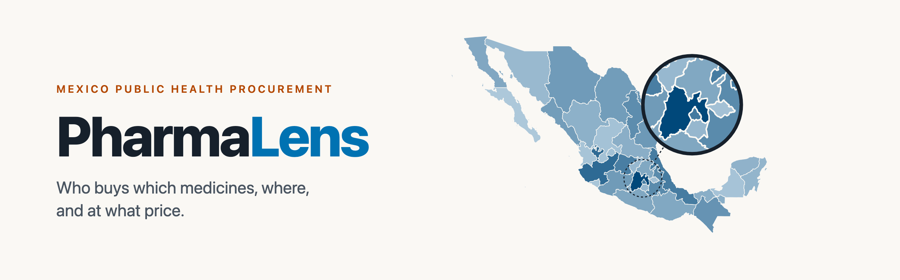
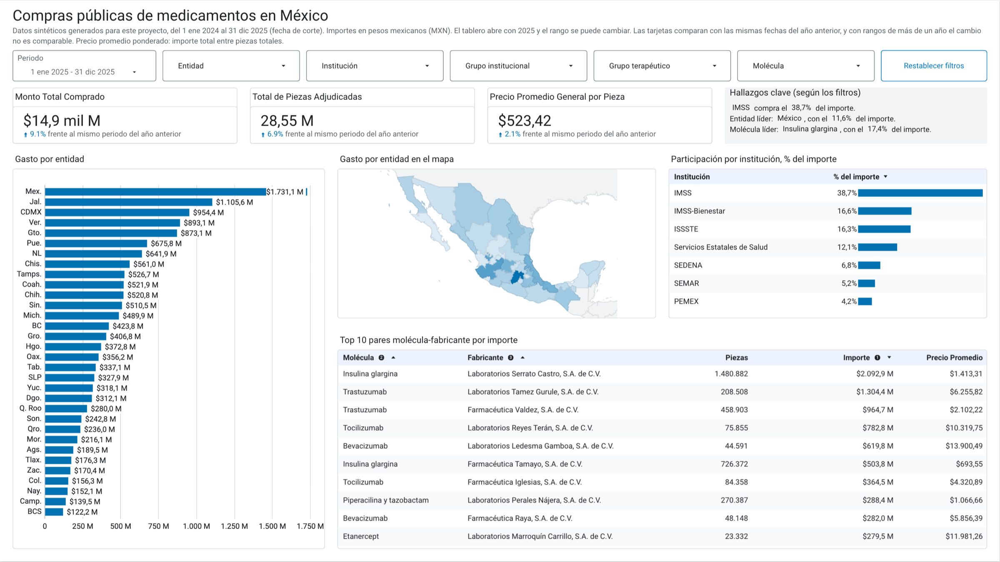
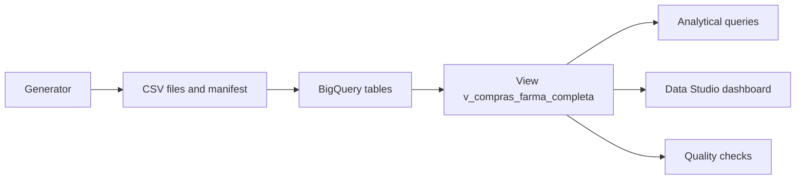

<p align="center">
  
</p>

<p align="center">
  <a href="https://github.com/Tjimenez1303/farma-analytics-bigquery/actions/workflows/checks.yml"></a>
  <a href="LICENSE"></a>
  
  
  
</p>

PharmaLens is an analytics project on public medicine purchases in Mexico, built on BigQuery and Data Studio. It answers three questions a pharmaceutical lab asks before a sale: which institutions and states buy the most, which molecules carry the spend, and what each manufacturer charges per unit.

The repository covers the whole path. A versioned generator produces the data, a dimensional model in BigQuery stores it, SQL checks prove it is consistent, and an interactive dashboard puts it in front of an analyst. The data is synthetic. It contains no real purchases and no personal data.

> The detailed documentation in [`docs/`](docs) and the specifications in [`specs/`](specs) are written in Spanish. The dashboard labels are in Spanish too.

## Dashboard

<p align="center">
  
</p>

<p align="center"><a href="https://datastudio.google.com/reporting/47a2dbb4-120b-4324-8af0-6216a40771c6">Open the live dashboard</a>, no Google account needed.</p>

The dashboard opens on 2025 and compares every card with the same dates a year earlier. Five cascading filters (state, institution, institutional group, therapeutic group and molecule) drive every chart, and a click on a bar or a state filters the rest of the page. The "Hallazgos clave" box rewrites its three findings as the filters change.

## Highlights

- Reproducible data. The generator writes three CSV files and a manifest with the SHA-256 hash of each one, so anyone can check they have the same bytes.
- One schema, written once. [`sql/farma_analytics.sql`](sql/farma_analytics.sql) holds the DDL, the view and the analytical queries, and runs as is in the BigQuery console. The load derives its schema from that file.
- Checks that prove themselves. Seven quality checks return zero rows when their rule holds, and each one has a negative case that must fail.
- Figures that match. `make bq-dashboard` runs the same filters as the dashboard in SQL and cross-checks the totals, so the cards, the state ranking and the top 10 can be audited.
- Costs under control. A per-query byte limit, a daily project quota and a budget alert.
- Accessible design. One data color from the Okabe-Ito palette, WCAG 2.1 AA contrast checked by a test, and change shown with an arrow, never with color alone.

## How it works



| Folder | Contents |
|---|---|
| [`generator/`](generator) | Synthetic data generator, its configuration and the reference manifest |
| [`sql/`](sql) | DDL, view and queries, plus the quality checks and the dashboard queries |
| [`warehouse/`](warehouse) | Python program behind the BigQuery targets of the `Makefile` |
| [`scripts/`](scripts) | Environment diagnosis, GCP setup and the prose linter |
| [`docs/`](docs) | Synthetic data, dashboard specification and traceability matrix |
| [`tests/`](tests) | Tests that run without network or credentials |

## Requirements

| Tool | Minimum version |
|---|---|
| Google Cloud CLI (`gcloud` and `bq`) | 500.0.0 |
| uv | 0.12.0 |
| GNU Make | 3.81 |
| ripgrep | 14.0.0 |
| Git | any recent version |

The minimum versions live in [`scripts/tool_versions.env`](scripts/tool_versions.env). You do not need to install Python by hand: uv downloads the version pinned in [`.python-version`](.python-version) the first time, and installs the exact development dependencies from `uv.lock`.

You also need a Google Cloud billing account. With this volume the usage fits in the BigQuery free tier.

## Installation

### macOS

With [Homebrew](https://brew.sh):

```bash
brew install --cask google-cloud-sdk
```

```bash
brew install uv ripgrep
```

This command installs `make` and `git` if you do not have them yet:

```bash
xcode-select --install
```

### Linux

On Debian or Ubuntu 24.04 or later, whose ripgrep already meets the minimum. First the system tools:

```bash
sudo apt-get update && sudo apt-get install -y apt-transport-https ca-certificates gnupg curl make git ripgrep
```

Then Google Cloud CLI, from the [official package repository](https://docs.cloud.google.com/sdk/docs/install):

```bash
curl https://packages.cloud.google.com/apt/doc/apt-key.gpg | sudo gpg --dearmor -o /usr/share/keyrings/cloud.google.gpg
```

```bash
echo "deb [signed-by=/usr/share/keyrings/cloud.google.gpg] https://packages.cloud.google.com/apt cloud-sdk main" | sudo tee -a /etc/apt/sources.list.d/google-cloud-sdk.list
```

```bash
sudo apt-get update && sudo apt-get install google-cloud-cli
```

And uv, with its installer:

```bash
curl -LsSf https://astral.sh/uv/install.sh | sh
```

### Windows

The `Makefile` and the scripts need Bash, so on Windows the project runs inside [WSL 2](https://learn.microsoft.com/en-us/windows/wsl/install) with Ubuntu. It requires Windows 10 version 2004 or later, or Windows 11. Open PowerShell as administrator, run this command and restart the computer:

```powershell
wsl --install
```

Open Ubuntu from the Start menu, create your Linux user and follow the [Linux](#linux) steps inside it. Clone the repository in your Linux home folder (for example `~/farma-analytics-bigquery`) and not under `/mnt/c`, because file access across the two systems is much slower. If `gcloud auth login` cannot open a browser, it prints a link that you can open in Windows.

## Quick start

These steps create a new GCP project for this repository and leave the environment ready. In the commands, `<PROJECT_ID>` is the ID you choose for the project and `<BILLING_ACCOUNT_ID>` is the ID of your billing account.

1. Clone the repository and enter the folder.

   ```bash
   git clone https://github.com/Tjimenez1303/farma-analytics-bigquery.git
   ```

   ```bash
   cd farma-analytics-bigquery
   ```

2. Sign in to Google Cloud with your user account.

   ```bash
   gcloud auth login
   ```

3. Create the project and link it to your billing account. Without `--name`, the display name of the project is its ID. The second command lists the billing accounts you can use. If it comes back empty, create one on the [billing page of the console](https://console.cloud.google.com/billing) before you go on.

   ```bash
   gcloud projects create <PROJECT_ID>
   ```

   ```bash
   gcloud billing accounts list
   ```

   ```bash
   gcloud billing projects link <PROJECT_ID> --billing-account=<BILLING_ACCOUNT_ID>
   ```

4. Make it the default project and enable the APIs the repository uses.

   ```bash
   gcloud config set project <PROJECT_ID>
   ```

   ```bash
   gcloud services enable bigquery.googleapis.com billingbudgets.googleapis.com cloudquotas.googleapis.com cloudbilling.googleapis.com --project=<PROJECT_ID>
   ```

5. Create the Application Default Credentials (ADC), which the Google Cloud libraries use, and set the project that carries their quota.

   ```bash
   gcloud auth application-default login
   ```

   ```bash
   gcloud auth application-default set-quota-project <PROJECT_ID>
   ```

6. Copy the local configuration and fill in your values. The file explains each variable.

   ```bash
   cp .env.example .env
   ```

7. Install the development environment, with Python and the quality tools.

   ```bash
   make setup-dev
   ```

8. Apply the project settings: GoogleSQL only, a daily query quota and a budget alert.

   ```bash
   make gcp-setup
   ```

9. Check that everything is in order. The diagnosis only runs dry runs and metadata reads, so it bills nothing.

   ```bash
   make doctor
   ```

The program messages are in Spanish. A healthy run looks like this, with B03 skipped until the `farma_analytics` dataset exists:

```text
Diagnóstico de farma-analytics-bigquery

OK       T01  gcloud                          540.0.0 (mínimo 500.0.0)
OK       T02  bq                              2.1.20 (mínimo 2.1.0)
OK       T03  Python del proyecto             3.12.14
OK       T06  SQLFluff                        4.3.0
OK       T07  pre-commit                      4.6.2
OK       T08  ripgrep                         14.1.1 (mínimo 14.0.0)
OK       T09  make                            3.81 (mínimo 3.81)
OK       T10  uv                              0.12.9 (mínimo 0.12.0)
OK       C01  .bigqueryrc del repositorio     location US, GoogleSQL, límite de bytes
OK       C02  ~/.bigqueryrc personal          no existe
OK       C03  Credenciales en el repositorio  GOOGLE_APPLICATION_CREDENTIALS vacío
OK       N01  Red                             Google APIs accesibles
OK       A01  Cuenta de gcloud                persona@example.com
OK       A02  ADC                             credencial válida
OK       A03  Proyecto de cuota de ADC        mi-proyecto
OK       A04  Misma cuenta en gcloud y ADC    persona@example.com
OK       P01  Proyecto de GCP                 mi-proyecto
OK       P02  Facturación                     activa
OK       B01  Dry run en la location          validado en US
OK       B02  Dialecto del proyecto           legacy SQL rechazado
OMITIDO  B03  Location de farma_analytics     el dataset aún no existe
              remedio: sin acción
OK       B04  Límite de bytes                 1.00 GiB por consulta

Resumen: 21 OK, 0 AVISO, 0 FALLO, 1 OMITIDO
```

When a check fails, its `remedio:` line gives the command or step that fixes it. `make help` lists every target.

## Synthetic data

The data of the three sources (`COMPRAS`, `CLUE_CAT` and `CUADRO_BASICO`) is synthetic. Manufacturers, brands and suppliers are fictitious companies, and medical units, codes and purchases are made up too. The names of states, municipalities, institutions and molecules are real, so the analysis resembles a true market. [`docs/datos_sinteticos.md`](docs/datos_sinteticos.md) describes each field, the patterns the generator injects on purpose and the sources of the reference catalogs.

To generate the data in `data/` and check that it matches the reference:

```bash
make data
```

The command writes the three CSV files and a manifest with the SHA-256 hash of each one, and compares it with [`generator/manifest.json`](generator/manifest.json). Every file must come out as `OK`. A `DIFIERE` means the bytes do not match, and the message shows the Python, NumPy and Faker versions on each side, because an exact match is only guaranteed in the same environment. `make data-verify` repeats the check without generating again.

The `data/` folder is not versioned. When a change to [`generator/config.toml`](generator/config.toml) is intentional, `make data-manifest` updates the reference manifest, and both files go in the same pull request.

## Loading into BigQuery

The schema of the three tables is written once, in sections 1 and 2 of [`sql/farma_analytics.sql`](sql/farma_analytics.sql). You can run the whole file in the BigQuery console, and the `make` targets use it as their only source: they create the dataset and the tables with its statements and derive from them the schema used to load the CSV files. These targets work on the GCP project, so whoever runs them needs access to it.

1. Generate the data and check it against the manifest.

   ```bash
   make data
   ```

2. Create the `farma_analytics` dataset and the `COMPRAS`, `CLUE_CAT` and `CUADRO_BASICO` tables.

   ```bash
   make bq-schema
   ```

   Each statement goes through a dry run first and only runs if the validation passes. At the end, the command compares what BigQuery published with the DDL (location, labels, types, modes and descriptions) and ends with `Metadatos: 0 diferencias con la DDL`. Running it again changes nothing, because the statements use `CREATE ... IF NOT EXISTS`.

3. Load the CSV files.

   ```bash
   make bq-load
   ```

   Before calling BigQuery, the command checks `data/` against the manifest and the published tables against the DDL. Then it replaces each table with a single load job (`bq load --replace`) that uses the schema derived from the DDL, with no autodetection and no bad rows allowed. A load job is atomic, so if it fails the table keeps what it had. When it finishes it runs the checks and prints a fingerprint of each table, which comes out the same if you load the same files twice. The load does not create or modify the view of the next section. If the view already exists, it also runs its check, and if it does not exist yet it says so without failing.

4. Review the tables without loading them again.

   ```bash
   make bq-checks
   ```

5. Check that each quality check catches the error it is meant to catch.

   ```bash
   make bq-checks-negativos
   ```

   Each check runs on a few made-up rows that carry an error on purpose, written inside the query instead of the real tables, so no bytes are billed. Use it to test a check after changing it.

The checks live in [`sql/checks/`](sql/checks), one per file, and each returns 0 rows when its rule holds:

- The row count of each table matches the manifest (300 000, 2 000 and 161).
- `CLUE` is unique in `CLUE_CAT` and `CLAVE` is unique in `CUADRO_BASICO`.
- The keys, `FECHA`, `PIEZAS` and `IMPORTE` have no nulls.
- `PIEZAS` is greater than zero, `IMPORTE` is not negative and `FECHA` falls inside the generator period.
- The rows and the amount of `COMPRAS` add up to the `INNER JOIN` with both catalogs plus the orphan rows, which are 750 by `CLUE` and 750 by `CLAVE`.
- The unit price of each catalog `CLAVE` stays between 6.75 and 17 820 pesos, and the most expensive is at most 4.4 times the cheapest.
- The view has the rows of `COMPRAS` minus the orphans, its `IMPORTE` and `PIEZAS` add up to the `INNER JOIN` of the tables, and its computed columns have no nulls.

None of those figures is written in the SQL. The program reads them from the manifest and from [`generator/config.toml`](generator/config.toml) and passes them to each query as parameters, so if the generator configuration changes the checks change with it. The price limits come from the price parameters: the lowest base price times the lowest generic factor and the downward noise, and the highest base price times the highest reference factor and the upward noise.

Every query goes through a dry run, carries the `project` and `env` labels to attribute its cost and respects the 1 GiB limit of `.bigqueryrc`. Load jobs are the exception, because `bq load` supports neither dry runs nor labels. That is why the CSV files and the schema are validated before loading, and a load job processes no query bytes, so the limit does not apply to it.

The tables are neither partitioned nor clustered. Together they weigh about 32 MB, and the BigQuery documentation places the benefit of clustering above 64 MB and the benefit of partitioning at partitions of several GB. They do not declare foreign keys either, because `COMPRAS` has orphans on purpose and BigQuery would use those constraints to remove joins and return wrong figures.

If you change a description in the DDL after creating the tables, `make bq-schema` does not apply it, since `CREATE TABLE IF NOT EXISTS` does not modify an existing table. The metadata comparison flags the difference, and you fix it with `ALTER TABLE ... SET OPTIONS` or `ALTER TABLE ... ALTER COLUMN ... SET OPTIONS` on the affected object.

Run `make bq-load` again only when the data changes. Each reload rewrites the tables and restarts the 90 days BigQuery waits before billing them as long-term storage. At this volume the saving is small, but there is no reason to lose it.

## View and analytical queries

The `v_compras_farma_completa` view joins each line of `COMPRAS` with its medical unit from `CLUE_CAT` and its item from `CUADRO_BASICO`. It has one row for each purchase line whose `CLUE` and `CLAVE` exist in the catalogs, so the 1 500 orphan lines stay out and the view has 298 500 rows, as the `reconciliacion_vista` check confirms. The analytical queries and the dashboard read only from it, so they give the same figures.

`FABRICANTE` appears in `COMPRAS` and in `CUADRO_BASICO` with different meanings, so the view splits it into `FABRICANTE_COMPRA`, the manufacturer of the delivered product, and `FABRICANTE_CATALOGO`, the reference manufacturer of the molecule. It adds three computed columns per row for the dashboard. `ANIO` and `MES` (the first day of the month) serve time series and yearly comparisons, and `ENTIDAD_ISO` holds the ISO 3166-2 code of the state, which Data Studio recognizes on maps without confusing the State of Mexico with the country. No column stores a price, because an average price cannot be summed across rows and has to be computed at query time.

The view and its queries are in sections 3 and 4 of [`sql/farma_analytics.sql`](sql/farma_analytics.sql). These targets also work on the GCP project.

1. Create or replace the view.

   ```bash
   make bq-vista
   ```

   The statement goes through a dry run first. Replacing the view deletes no data, because a logical view stores none. Then the seven checks run along with the comparison of the view metadata (type, dialect, columns and descriptions), and the output ends with `Chequeos: 7 de 7 en 0 filas. Metadatos: 0 diferencias.` If you change the view, running this command again is enough, with no need to reload the tables.

2. Answer the three business questions.

   ```bash
   make bq-consultas
   ```

   It first computes the rows and totals of the view, and stops if the view is empty. Then it runs the four queries of section 4, each with its dry run, and prints the full answers of the first two and the first 20 rows of the price queries, which have hundreds. The BigQuery console shows them in full. Finally it checks that the figures agree across queries and with the view total, and ends with `Cifras cruzadas: 5 de 5 cuadran.`

Each metric has a single definition, the same in the SQL, the dashboard and the documents:

| Metric | Definition |
|---|---|
| Total amount | `SUM(IMPORTE)` |
| Units | `SUM(PIEZAS)` |
| Average price | `SUM(IMPORTE) / SUM(PIEZAS)`, with `SAFE_DIVIDE` in SQL |
| Average amount per line | `AVG(IMPORTE)` |
| Share | value of the group over the view total, as a percentage |

Some questions allow more than one reading. These are the ones we use and the reason for each:

| Question | Definition | Reason |
|---|---|---|
| What purchase volume means | `SUM(IMPORTE)`, and the same query shows `SUM(PIEZAS)` as an alternative | It is the measure of the molecules question and the spend measure of the dashboard |
| Institution and state together or apart | All three readings: the pair, the institution alone and the state alone | All three come from a single read of the view with `GROUPING SETS` |
| Which manufacturer the price uses | `FABRICANTE_COMPRA`, and another query gives the price by `FABRICANTE_CATALOGO` | It is who sold at that price. Each molecule has one reference manufacturer, so the alternative equals the price of the molecule across the market |
| Ties | In the top 5 molecules, alphabetical order decides who makes the cut. The leaders use `RANK`, which shows every tied row | The first answer must have exactly 5 rows, and the second must not hide a tie |

The average price by molecule mixes presentations with different pack sizes, because the question asks for the price by molecule and not by `CLAVE`. To compare presentations, group by `CLAVE` or by `PRESENTACION`.

## Dashboard figures

The full dashboard specification, with fields, colors, grid, controls and what was checked in the product, is in [`docs/dashboard.md`](docs/dashboard.md). Data Studio is not versioned as code, so that document is the reference to review or rebuild it.

The dashboard reads from a single reusable data source connected to the `v_compras_farma_completa` view, with no custom queries. The source uses the owner's credentials, so whoever opens the link sees the data without BigQuery access, and it caches the data for 12 hours. The average price is computed in the source as `SUM(Importe) / NULLIF(SUM(Piezas), 0)`, with the same definition as the SQL.

This target checks the dashboard figures against the view, and also works on the GCP project:

```bash
make bq-dashboard
```

It runs the queries in [`sql/dashboard/`](sql/dashboard) with dry runs and labels, prints what the cards, the spend by state, the share by institution and the top 10 must show, and ends with `Cifras cruzadas del dashboard: 4 de 4 cuadran.` Its variables mirror the dashboard controls: `DESDE` and `HASTA` for the period, and `ENTIDAD`, `INSTITUCION`, `GRUPO_INSTITUCIONAL`, `GRUPO_TERAPEUTICO` and `MOLECULA` for the lists, with several values separated by commas. For example, this gives what the dashboard shows with Jalisco selected:

```bash
make bq-dashboard ENTIDAD=Jalisco
```

The cards compare the chosen range with the same dates a year earlier, and the target computes that period the same way Data Studio does. The log of the comparisons between the dashboard and the SQL is in the "Verificación contra el SQL" section of `docs/dashboard.md`.

Only the report owner can edit it, change its source or share it. The repository stores no Data Studio credentials.

The queries Data Studio sends do not go through `.bigqueryrc`, so its byte limit does not cover them. The daily project quota protects them (see [Cost controls](#cost-controls)). Each one carries the `requestor` label (with the value `looker_studio`), `looker_studio_report_id` and `looker_studio_datasource_id`, which separate its cost in `INFORMATION_SCHEMA.JOBS`.

## Cost controls

The repository limits spending in three layers, because none of them covers every case on its own.

The [`.bigqueryrc`](.bigqueryrc) file sets a limit of 1 GiB billed per query. If the estimate of a query goes above it, BigQuery rejects it before running it and charges nothing. This limit only protects the queries that `bq` sends from the `Makefile`, since the BigQuery console and the Python libraries do not read that file. Changing it means editing one line, and it goes through a pull request like any other change.

The daily query quota of the project (`make gcp-quota`) covers everything else. Its value is in `.env` as `QUERY_QUOTA_GIB_PER_DAY`, with 100 GiB per day in the example. It is a hard cap: once reached, BigQuery returns the `usageQuotaExceeded` error to every query of the project until midnight Pacific time. To change it you need the Quota Administrator role (`roles/servicemanagement.quotaAdmin`).

The budget alert (`make gcp-budget`) emails the billing account administrators when the monthly spend reaches 50 %, 90 % and 100 % of `BUDGET_AMOUNT`. It warns but does not stop spending. To create it you need the Billing Account Administrator or Billing Account Costs Manager role.

With the volume of this project, usage fits in the BigQuery free tier and these controls act as a safety net. You can check them by hand in the Google Cloud console. The budget is under Billing, in Budgets and alerts. The quota is under IAM and admin, in Quotas and system limits, by searching for "Query usage per day" of the BigQuery API.

If the project loses its billing account, BigQuery switches to sandbox mode. In that mode there is no budget or quota to apply, and tables and views expire after 60 days. That is why this repository uses a project with billing.

### SQL dialect and bq configuration

`make gcp-dialect` sets the project option `default_sql_dialect_option = 'only_google_sql'`, and from then on BigQuery rejects legacy SQL jobs that arrive through the CLI or the API. The documentation does not guarantee it for the console, so we tested it on October 8, 2026: a query with the `#legacySQL` prefix in the console is rejected too, with the message "Legacy SQL queries are not supported in this project". The option is regional, so it applies to the region of the `.bigqueryrc` location (`region-us`). Before running the `ALTER PROJECT`, the target validates it with a dry run and stops if the validation fails. To change project options you need the BigQuery Admin role.

The `Makefile` exports `BIGQUERYRC` so that `bq` uses the `.bigqueryrc` of the repository. If you run `bq` outside `make`, it uses your personal `~/.bigqueryrc` unless you export the variable first:

```bash
export BIGQUERYRC="$PWD/.bigqueryrc"
```

## Quality

Every commit goes through the automatic checks that `make setup-dev` installs with pre-commit. SQLFluff checks the style of the `.sql` files with the rules in [`.sqlfluff`](.sqlfluff), Ruff checks the style and format of the Python code with the configuration in [`pyproject.toml`](pyproject.toml), and another hook blocks `.env` files, service account keys and other credential files. GitHub Actions runs the same checks and the tests on every pull request to `main`, with no access to GCP. The checks report on the pull request but do not block the merge.

These targets run the checks by hand:

- `make lint` runs every pre-commit check on the repository, with the same command GitHub Actions uses.
- `make lint-sql` checks only the SQL style.
- `make test` runs the tests of the scripts, the data generator and the load program, which need no network or credentials.
- `make lint-prosa` checks the README and the `docs/` folder.

The prose linter is not part of the hooks. Run it before opening each pull request, and also on the commit message and the pull request description, which the script reads from standard input:

```bash
git log -1 --format=%B | scripts/lint_prosa.sh -
```

The list of filler words is in [`scripts/muletillas.txt`](scripts/muletillas.txt) and grows by adding a line. The allowed technical terms and the proper nouns that can be capitalized in a heading are in [`scripts/prosa_excepciones.txt`](scripts/prosa_excepciones.txt). For a one-off false positive, mark the line with the comment `<!-- lint-prosa: ignorar -->`.

## Documentation

| Document | Contents |
|---|---|
| [`docs/datos_sinteticos.md`](docs/datos_sinteticos.md) | Fields, injected patterns and sources of the synthetic data |
| [`docs/dashboard.md`](docs/dashboard.md) | Dashboard specification and its checks against the SQL |
| [`docs/trazabilidad.md`](docs/trazabilidad.md) | Traceability matrix from each requirement to its evidence |
| [`specs/`](specs) | Specification, plan and tasks of each feature |

## License

[MIT](LICENSE)
